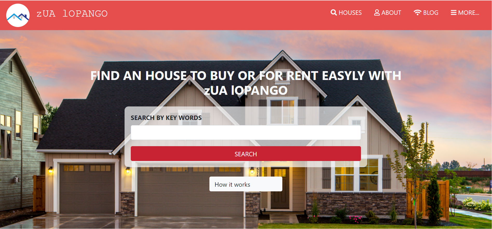
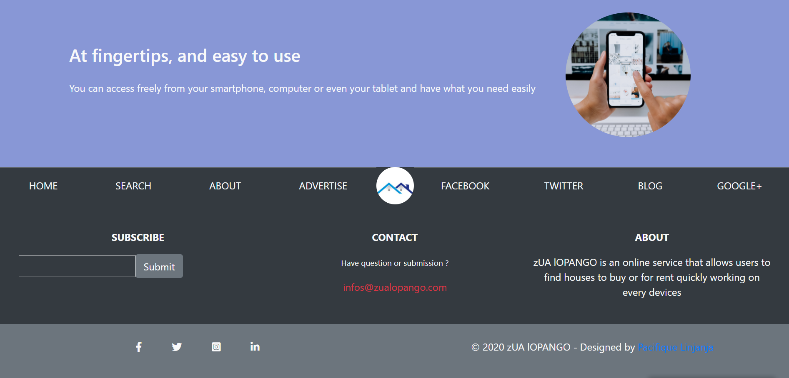
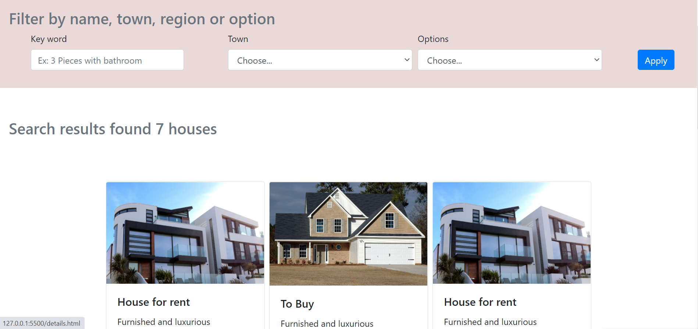
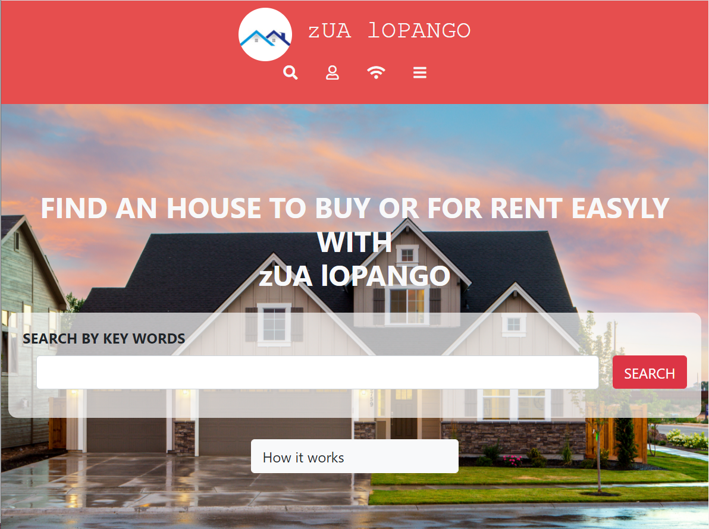
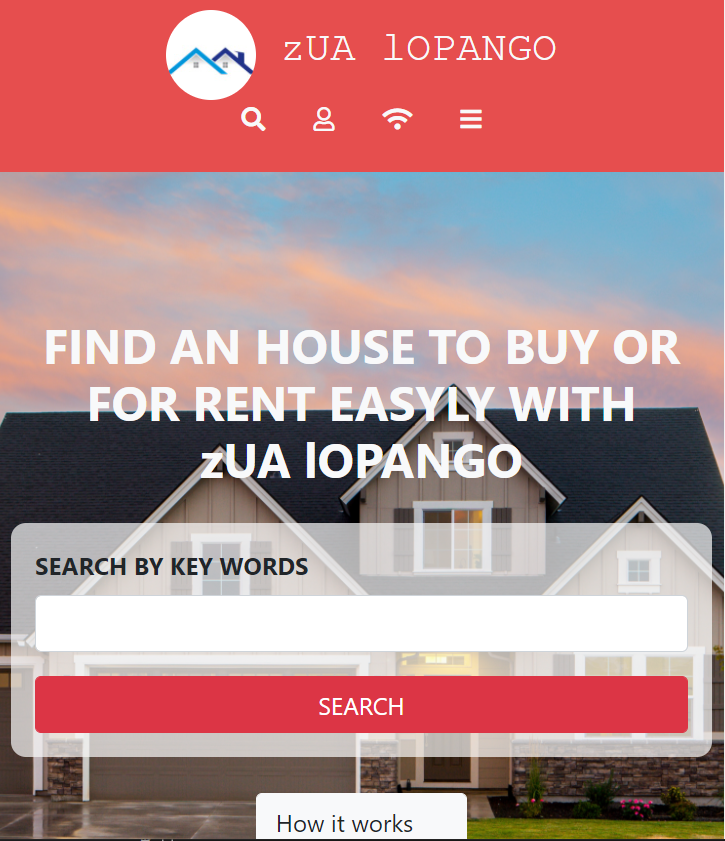

# House directory - HTML AND CSS Capstone Project

> This project is the HTML and CSS capstone project, we built a house directory that allows users to find houses for rent or houses to buy, this project has 3 pages which are :

- The search page: the main page where users can enter keywords to find houses that match their criteria
- The search results page: This page displays the result of the entered keywords
- The details page: which contains the details about the single item selected
We built this solution using HTML and CSS helped by the Bootstrap framework 

>> 1. Desktop

>>> 
>>> 
>>> 

>> 2. Tablet

>>> 

>> 3. Mobile

>>> 

## Built With

- HTML
- CSS (Used grid , flex and float)
- Bootstrap framework

## Live Demo

[Live Demo Link](https://pacyl2k19.github.io/html-css-capstone/index.html)

## Loom Presentation
https://www.loom.com/share/9903f347bfe34871a3468a862d41aace

## Getting Started

1. First clone the project 
  `$ git clone https://github.com/pacyL2K19/html-css-capstone.git`
2. Then open index.html in your browser
3. [optional] You can even fork the project 

To get a local copy up and running follow these simple example steps.

### Prerequisites

Just ensure you have one or more web browsers

## 👤 Author

- GitHub: [@pacyL2K19](https://github.com/pacyL2K19)
- Twitter: [@PacifiqueLinja1](https://twitter.com/PacifiqueLinja1)
- LinkedIn: [LinkedIn](https://www.linkedin.com/in/pacifique-linjanja-2a565517b/)

## 🤝 Contributing

Contributions, issues, and feature requests are welcome!
Feel free to contribute 
Feel free to check the [issues page](https://github.com/pacyL2K19/html-css-capstone/issues/1).

## Show your support

Give a ⭐️ if you like this project!

